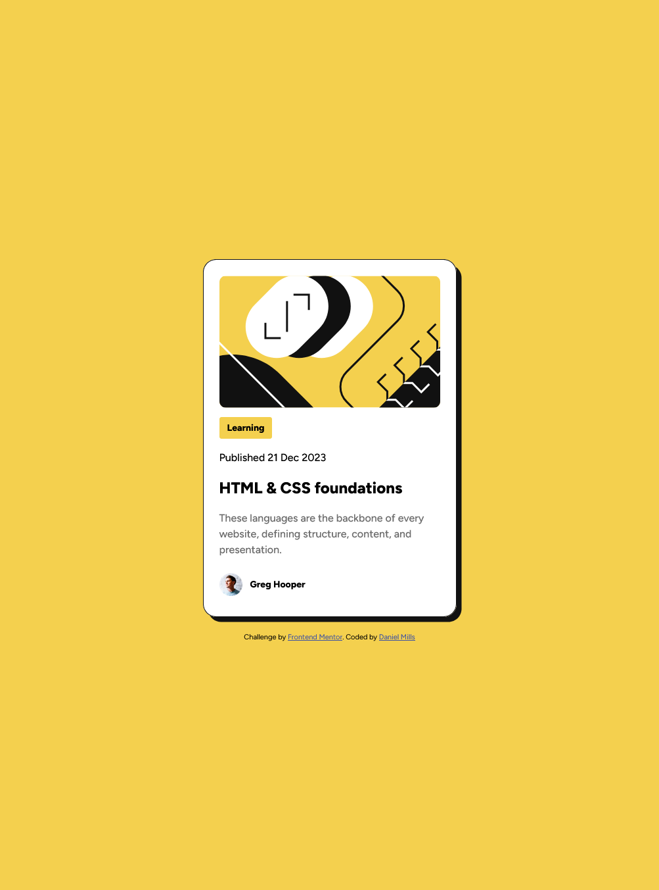

# Frontend Mentor - Blog preview card solution

This is a solution to the [Blog preview card challenge on Frontend Mentor](https://www.frontendmentor.io/challenges/blog-preview-card-ckPaj01IcS). Frontend Mentor challenges help you improve your coding skills by building realistic projects. 

## Table of contents

- [Overview](#overview)
  - [The challenge](#the-challenge)
  - [Screenshot](#screenshot)
  - [Links](#links)
- [My process](#my-process)
  - [Built with](#built-with)
- [Author](#author)

## Overview
Blog card challenge.  This one came with a Figma file, so there wasn't as much guess work on spacing and fonts.
### The challenge
- Create the card from the Figma file
- Hover and Focus states

### Screenshot

### Links
- Live Site URL: [Blog Card Site](https://dmblog-card.netlify.app/)

## My process
- Started with the HTML
- Defined CSS Variables according to the Figma design
- Created the styles
### Built with

- Semantic HTML5 markup
- CSS custom properties
- Flexbox

## Author
- Frontend Mentor - [@djmills89](https://www.frontendmentor.io/profile/djmills89)

